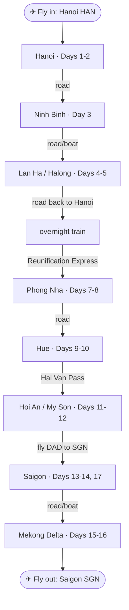

# Vietnam — Group Trip (8–10 people)

**Dates:** Fri 27 Nov 2026 (depart Warsaw, eve) → Tue 15 Dec 2026 (home). ~17 days on the ground.
**Flights:** Turkish Airlines, open-jaw, single ticket — **WAW → Istanbul → Hanoi (HAN)** out, **Saigon (SGN) → Istanbul → WAW** back.
**Who:** Group of 8–10 (assemble in Warsaw; Gliwice ~3 h rail, Zielona Góra ~4.5 h rail / feeder).
**Style:** Explorer-historian — history + nature + unusual transport + viewpoints; independent, hidden-gems, street food, off-peak.
**Route:** Hanoi → Ninh Binh → Lan Ha/Halong → *overnight train* → Phong Nha → Hue → Hoi An/My Son → *fly* → Saigon → Mekong.

> **Why ~17 days, not 14:** the extra days add **Phong Nha** (river-caves by boat — a strong profile fit), two **flex/rest days** so it isn't a forced march for 10 people, and keep the weather sequencing intact (north in the late-Nov dry window; central coast hit 5–9 Dec as it dries out; south dry in early Dec). A full **Ha Giang loop** would need ~3 weeks — kept as an optional front extension.

---

## Route map

---

## Transport details & where to book

| # | Leg | Means | Distance / time | Book |
|---|-----|-------|-----------------|------|
| ✈ | **WAW → HAN** (fly in) | Turkish Airlines, open-jaw single ticket via Istanbul | Overnight, ~13–15 h incl. layover | [Turkish Airlines](https://www.turkishairlines.com) · [Google Flights](https://www.google.com/travel/flights) |
| 1 | **Hanoi → Ninh Binh** | Private van/minibus (best for the group); limousine van or train alt. | ~95 km · ~2 h (train ~2–2.5 h) | [12Go](https://12go.asia/en/travel/hanoi/ninh-binh) · [Baolau](https://www.baolau.com/en/s/Hanoi/Ninh-Binh/bus) · [dsvn.vn](https://dsvn.vn) |
| 2 | **Ninh Binh → Lan Ha Bay** | Road transfer to Got/Hai Phong pier, then overnight junk cruise | Transfer ~3.5–4 h, then board | [Cruises — 12Go](https://12go.asia/en/travel/hanoi/cat-ba) · [HP→Cat Ba ferry](https://www.baolau.com/en/s/Hai-Phong/Cat-Ba/boat) |
| 3 | **Lan Ha → Hanoi** | Road back to Hanoi for the night train | ~2.5–3 h | (return shuttle, usually cruise-included) |
| 4 | **Hanoi → Phong Nha** | Overnight Reunification Express sleeper to Dong Hoi (4-berth soft sleeper), then ~45 min van | ~10 h overnight (e.g. SE19 ~21:00→~06:00) | [dsvn.vn (official)](https://dsvn.vn) · [Baolau](https://www.baolau.com/en/s/Hanoi/Dong-Hoi/train) · [12Go](https://12go.asia/en/travel/hanoi/dong-hoi) |
| 5 | **Phong Nha → Hue** | Private van/minibus or bus | ~210 km · ~4–4.5 h | [12Go](https://12go.asia/en/travel/phong-nha/hue) · [Baolau](https://www.baolau.com/en/s/Phong-Nha/Hue/bus) |
| 6 | **Hue → Hoi An** | Private car/van over the Hai Van Pass; or scenic Hue→Da Nang train + road | Direct ~3 h, ~4 h with stops (train ~2.5–3 h) | [12Go](https://12go.asia/en/travel/hue/hoi-an) · [Scenic train](https://www.baolau.com/en/s/Hue/Da-Nang/train) |
| 7 | **Da Nang → Saigon** | Internal flight (Vietnam Airlines / VietJet / Bamboo) | Road to DAD ~45 min, flight ~1 h 20 | [Vietnam Airlines](https://www.vietnamairlines.com) · [VietJet](https://www.vietjetair.com) · [Baolau](https://www.baolau.com/en/s/Da-Nang/Ho-Chi-Minh/plane) |
| 8 | **Saigon → Mekong Delta** | Road + sampan boats (usually a small-group tour with boats included) | Cai Be/Ben Tre ~1.5–2 h; Can Tho ~3.5–4 h | [12Go](https://12go.asia/en/travel/ho-chi-minh-city/can-tho) · [Baolau](https://www.baolau.com/en/s/Ho-Chi-Minh/Can-Tho/bus) |
| ✈ | **SGN → WAW** (fly out) | Turkish Airlines via Istanbul (return half of the open-jaw ticket) | Evening Day 17, home Tue 15 Dec | [Turkish Airlines](https://www.turkishairlines.com) |

**Booking platforms:** **dsvn.vn** is the official Vietnam Railways site (cheapest for trains, Vietnamese-language — pay by card); **Baolau** and **12Go** are English-language aggregators that resell trains, buses, ferries and flights with a small markup but easier UX and group bookings. For the group, charter private minibuses with a driver per city leg — cheaper and far simpler than taxis for 8–10.

> **Book first / book early:** the Hanoi→Dong Hoi sleeper carriage block (night of 2 Dec), the Lan Ha cruise cabins/charter, and the DAD→SGN flights — all rise in price or sell out close to the date.

---

## Overnight junk cruise — Lan Ha Bay (Days 4–5)

The cruise is the signature transport experience of the trip: one night aboard a steel junk sailing the karst islands of Lan Ha Bay (the quieter bay next to Halong, departing the Got / Tuan Chau pier near Hai Phong). Most operators include a shuttle from Hanoi (~3.5–4 h each way) plus kayaking, cave tenders and meals.

**Indicative cost** — per person, 1 night, all-inclusive (transfer + cabin + meals + activities). December is low season, so expect the lower end / discounts:

| Tier | Approx. price pp / night | Example operators |
|------|--------------------------|-------------------|
| Budget (Cat Ba–based boats) | ~$90–140 | Cat Ba Express, La Pinta / Lan Ha budget junks |
| Mid-range | ~$150–230 | [Peony Cruise](https://peonycruises.com), Sena Cruises, [La Pandora](https://lapandoracruises.com) |
| Premium / luxury | ~$250–400+ | [Orchid Cruises](https://www.orchidcruises.com) (Trendy / Classic / Premium), [Perla Dawn Sails](https://perladawnsails.com), Heritage Bình Chuẩn |

> Prices are indicative and change with season/demand — **confirm live on the operator's site before booking.** For 2 nights (more time on the water), roughly double.

**Booking options:**

- **Direct with the operator** — usually the best price and flexibility, e.g. [Orchid Cruises booking](https://www.orchidcruises.com/booking/), [Perla Dawn Sails](https://perladawnsails.com).
- **Reputable operator/agent** — [Mr Linh's Adventures](https://www.mrlinhadventure.com) (well-regarded for Lan Ha / Bai Tu Long).
- **Compare across boats** — [12Go (Hanoi→Cat Ba incl. cruises)](https://12go.asia/en/travel/hanoi/cat-ba); aggregators like Klook and GetYourGuide also list cruises with reviews.

**For a group of 8–10:** ask about a **private cabin block** or a **whole-boat charter** — many smaller junks (e.g. Perla Dawn Sails, mid-range boats) have 10–20 cabins, so the group can sail together and often negotiate a charter rate off-season. Book this and the night train first; they're the two legs most likely to sell out.

---

## Day-by-day

### North (late November — dry, cool)

**Day 1 · Sat 27→28 Nov — fly + arrive Hanoi**
- Overnight Turkish flight via Istanbul; arrive Hanoi. Settle in the Old Quarter, easy evening walk around Hoan Kiem Lake, street beer on the bia hoi corner.

**Day 2 · Sun 29 Nov — Hanoi**
- *History:* Temple of Literature (1070), Imperial Citadel of Thang Long, Hoa Lo Prison.
- *Transport quirk:* cyclo loop through the 36 guild streets; Train Street.
- *Viewpoint + food:* rooftop café at sunset; bun cha, banh mi, egg coffee.

**Day 3 · Mon 30 Nov — Ninh Binh ("Halong on land")**
- *Unusual transport:* foot-rowed sampans through Trang An / Tam Coc karst caves.
- *History:* Hoa Lu, the 10th-c. ancient capital; Bich Dong cave pagoda.
- *Viewpoint:* climb Hang Mua (~500 steps) to the dragon ridge.
- Overnight Ninh Binh.

**Day 4 · Tue 1 Dec — Lan Ha Bay (board cruise)**
- Transfer to the coast; board a junk-style cruise from **Lan Ha** (quieter than central Halong).
- *Nature + transport:* kayak floating villages and hidden lagoons; tender boats into caves. Overnight aboard.

**Day 5 · Wed 2 Dec — Lan Ha → Hanoi → night train**
- Morning on the bay (sunrise from the top deck, Ti Top summit). Disembark, return to Hanoi.
- *Signature transport:* evening **Reunification Express sleeper** south toward Dong Hoi (4-berth soft-sleeper; book a carriage block).

### Central (early December — drying out)

**Day 6 · Thu 3 Dec — arrive Phong Nha**
- Arrive Dong Hoi, transfer to Phong Nha. Afternoon: the village, riverside, easy first cave.

**Day 7 · Fri 4 Dec — Phong Nha caves**
- *Caves + boat:* Phong Nha Cave by river boat; Paradise Cave (vast); optional Dark Cave (zipline + mud). National-park karst and jungle viewpoints.

**Day 8 · Sat 5 Dec — Phong Nha → Hue**
- Morning countryside (botanic garden / Bong Lai valley by scooter). Transfer south to **Hue**.

**Day 9 · Sun 6 Dec — Hue**
- *History core:* Imperial Citadel & Forbidden Purple City (Nguyen dynasty); dragon-boat on the Perfume River to Thien Mu Pagoda.
- *Hidden gem:* the abandoned Ho Thuy Tien water park.

**Day 10 · Mon 7 Dec — Hue tombs → Hai Van Pass → Hoi An**
- *Active + viewpoints:* scooter/easy-rider loop to the royal tombs; then cross the **Hai Van Pass** to Hoi An, with Marble Mountains caves and a summit viewpoint near Da Nang.

**Day 11 · Tue 8 Dec — Hoi An + My Son**
- *Lost civilization:* dawn or late-afternoon **My Son** Cham ruins (UNESCO), off-peak.
- *History:* Hoi An Ancient Town — Japanese Covered Bridge, merchant houses, lantern streets after the day-trippers leave.

**Day 12 · Wed 9 Dec — Hoi An (flex)**
- Rest / bicycle through rice paddies to An Bang beach / basket-boat in the coconut groves / tailor / cooking class. Buffer day.

### South (early–mid December — dry, warm)

**Day 13 · Thu 10 Dec — fly Da Nang → Saigon**
- Short internal flight (DAD→SGN, ~1h20). Afternoon Saigon: Reunification Palace, Central Post Office & Notre-Dame, Ben Thanh market; rooftop viewpoint at dusk.

**Day 14 · Fri 11 Dec — Saigon + Cu Chi**
- *History + tunnels:* Cu Chi Tunnels and War Remnants Museum.
- Evening: Vespa/sidecar street-food night tour.

**Day 15 · Sat 12 Dec — Mekong Delta**
- *Transport + nature:* sampans through narrow canals; coconut-candy workshops, orchards. Overnight homestay (recommended) or river lodge.

**Day 16 · Sun 13 Dec — Mekong → Saigon**
- Dawn floating market (Cai Be / Cai Rang); return to Saigon. Buffer afternoon, last exploring.

**Day 17 · Mon 14 Dec — Saigon (depart)**
- Free day / coffee / final market run. Evening overnight Turkish flight SGN→IST→WAW; **home Tue 15 Dec.**

---

## Optional front extension — Ha Giang Loop (+3–4 days, ~3-week total)

For whoever's hardcore: the **Ha Giang motorbike loop** in the far north — the best mountain viewpoints in Vietnam and ethnic-minority markets. Run it before Day 1. Caveats: demanding, December mountains can be cold/cloudy, suits riders (or an "easy rider" driver-led version). Not a whole-group mandatory leg.

---

## Logistics notes for a group of 8–10

- **Assemble in Warsaw** the day before; Gliwice/Zielona Góra members rail in or take a feeder flight.
- **Trains:** book a full soft-sleeper carriage block early (Hanoi→Dong Hoi the night of 2 Dec is the key one).
- **Cruise:** charter a small boat or cabin block on a Lan Ha junk.
- **Ground transport:** private van/minibus with driver per city — cheap and far easier than taxis for 10.
- **Internal flight:** DAD→SGN — book as a group (Vietnam Airlines / VietJet); fares rise close to date.
- **Accommodation:** mid-range guesthouses/3★ with triples/family rooms; book the cruise, sleeper, Hoi An and Phong Nha first.

See `Vietnam-budget.xlsx` for the per-person breakdown vs the 10,000 PLN budget, and `README.md` for routing, dates and caveats.
