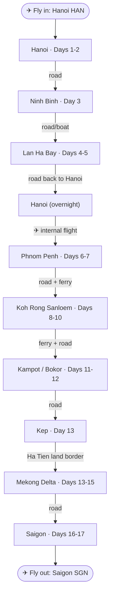

# Vietnam North + South Cambodia — Group Trip (8–10 people)

**Dates:** Sat 21 Nov 2026 (depart Warsaw 07:15) → Wed 9 Dec 2026 (home). ~17 days on the ground (22 Nov–8 Dec).
**Flights:** LOT + Vietnam Airlines, open-jaw single ticket — **WAW → Munich → Hanoi (HAN)** out (depart Sat 21 Nov 07:15, land 22 Nov 04:35), **Saigon (SGN) → Paris (CDG) → WAW** back (depart 8 Dec 23:25, home 9 Dec). Chosen over Turkish/Istanbul, which priced ~50% higher.
**Who:** Group of 8–10 (assemble in Warsaw; Gliwice ~3 h rail, Zielona Góra ~4.5 h rail / feeder).
**Style:** Explorer-historian — history + nature + unusual transport + viewpoints; independent, hidden-gems, street food, off-peak.
**Route:** Hanoi → Ninh Binh → Lan Ha → *fly* → Phnom Penh → Sihanoukville → **Koh Rong Sanloem** → Kampot/Bokor → Kep → *Ha Tien land border* → Mekong Delta → Saigon.

> **Why this shape:** dropping central Vietnam removes the one weather-sensitive leg, so the **week-earlier dates carry no rain penalty**. The open-jaw HAN-in/SGN-out ticket is **kept** because the route loops back to Saigon; only the internal flight changes (HAN→PNH instead of DAD→SGN). The coast runs **west→east** so Phnom Penh is never backtracked, and Kep's position by the border lets you cross at **Ha Tien** into the Mekong and finish at the Saigon airport. See `README.md` for the full rationale and the two visa/border gaps to confirm.

---

## Route map

---

## Transport details & where to book

| # | Leg | Means | Distance / time | Book |
|---|-----|-------|-----------------|------|
| ✈ | **WAW → HAN** (fly in) | LOT 351 + Vietnam Airlines 34, open-jaw via Munich | WAW 07:15 → MUC 08:55; MUC 12:20 → HAN 04:35 (+1) | [LOT](https://www.lot.com) · [Vietnam Airlines](https://www.vietnamairlines.com) |
| 1 | **Hanoi → Ninh Binh** | Private van/minibus (best for the group); limousine van or train alt. | ~95 km · ~2 h | [12Go](https://12go.asia/en/travel/hanoi/ninh-binh) · [Baolau](https://www.baolau.com/en/s/Hanoi/Ninh-Binh/bus) · [dsvn.vn](https://dsvn.vn) |
| 2 | **Ninh Binh → Lan Ha Bay** | Road transfer to Got/Hai Phong pier, then overnight junk cruise | Transfer ~3.5–4 h, then board | [Cruises — 12Go](https://12go.asia/en/travel/hanoi/cat-ba) · [HP→Cat Ba ferry](https://www.baolau.com/en/s/Hai-Phong/Cat-Ba/boat) |
| 3 | **Lan Ha → Hanoi** | Road back to Hanoi for the night | ~2.5–3 h | (return shuttle, usually cruise-included) |
| ✈ | **Hanoi → Phnom Penh** | Internal flight (Vietnam Airlines / VietJet / Cambodia Angkor Air) | ~2 h direct | [Vietnam Airlines](https://www.vietnamairlines.com) · [VietJet](https://www.vietjetair.com) · [Baolau HAN→PNH](https://www.baolau.com/en/s/Hanoi/Phnom-Penh/plane) |
| 4 | **Phnom Penh → Sihanoukville** | Express bus / private van (expressway) | ~230 km · ~3.5–4 h | [Giant Ibis](https://www.giantibis.com) · [12Go PP→Sihanoukville](https://12go.asia/en/travel/phnom-penh/sihanoukville) |
| 5 | **Sihanoukville → Koh Rong Sanloem** | Fast ferry (Island Speed Ferry / GTVC / Buva Sea) from the port | ~40 min–2 h · gov-fixed ~$12 one-way | [Island Speed Ferry](https://islandspeedferrycambodia.com) · [12Go ferries](https://12go.asia/en/travel/sihanoukville/koh-rong-sanloem) |
| 6 | **Koh Rong Sanloem → Kampot** | Ferry back to Sihanoukville, then road east | Ferry + ~1.5–2 h road | [12Go Sihanoukville→Kampot](https://12go.asia/en/travel/sihanoukville/kampot) |
| 7 | **Kampot → Kep** | Private van / tuk-tuk / local bus | ~25 km · ~40 min | [12Go Kampot→Kep](https://12go.asia/en/travel/kampot/kep) |
| 8 | **Kep → Ha Tien (Vietnam) → Mekong** | Road to **Prek Chak / Xà Xía** border, cross on foot, transfer into the Mekong Delta | Border ~30–45 min from Kep; then road | [12Go Kampot→Ha Tien](https://12go.asia/en/travel/kampot/ha-tien) · [Bookaway cross-border](https://www.bookaway.com) |
| 9 | **Mekong Delta → Saigon** | Road + sampan boats (Chau Doc / Can Tho → HCMC) | Can Tho → HCMC ~3.5–4 h | [12Go Can Tho→HCMC](https://12go.asia/en/travel/can-tho/ho-chi-minh-city) · [Baolau](https://www.baolau.com/en/s/Can-Tho/Ho-Chi-Minh/bus) |
| ✈ | **SGN → WAW** (fly out) | Vietnam Airlines 11 + LOT 332, via Paris (CDG) | SGN 23:25 → CDG 06:55 (+1); CDG 10:50 → WAW 13:15 | [Vietnam Airlines](https://www.vietnamairlines.com) · [LOT](https://www.lot.com) |

**Booking platforms:** **dsvn.vn** is the official Vietnam Railways site; **Baolau** and **12Go** are English aggregators reselling trains, buses, ferries and flights (small markup, easier UX, group-friendly). **Giant Ibis** is the most reliable Cambodian coach operator (Phnom Penh–Sihanoukville–Kampot–Kep). For the group, charter private minibuses with a driver per leg in both countries.

> **Book first / book early:** the Lan Ha cruise cabin block, the **HAN→PNH internal flight** (group fares climb near the date), and the **Koh Rong Sanloem resort + ferry** (the quiet bays have limited rooms). Confirm the **Vietnam multiple-entry e-visa** for all travellers and **Prek Chak e-visa eligibility** before anything else — see README.

---

## Overnight junk cruise — Lan Ha Bay (Days 4–5)

Unchanged from the original and still the signature water experience of the north: one night aboard a steel junk sailing the karst islands of **Lan Ha Bay** (quieter than central Halong, departing the Got / Tuan Chau pier near Hai Phong). Most operators include a Hanoi shuttle (~3.5–4 h each way) plus kayaking, cave tenders and meals.

| Tier | Approx. price pp / night | Example operators |
|------|--------------------------|-------------------|
| Budget (Cat Ba–based boats) | ~$90–140 | Cat Ba Express, La Pinta / Lan Ha budget junks |
| Mid-range | ~$150–230 | [Peony Cruise](https://peonycruises.com), Sena Cruises, [La Pandora](https://lapandoracruises.com) |
| Premium / luxury | ~$250–400+ | [Orchid Cruises](https://www.orchidcruises.com), [Perla Dawn Sails](https://perladawnsails.com), Heritage Bình Chuẩn |

> For 8–10, ask about a **private cabin block** or **whole-boat charter** — late Nov is low season, often discounted. Confirm live prices before booking.

---

## The island — Koh Rong Sanloem (Days 8–10)

Chosen over Koh Rong's main (party) beach to fit the off-track style. Three distinct bases:

- **Saracen Bay** — the main crescent of white sand, the widest choice of bungalow/villa resorts, calm east-facing water (sheltered from the monsoon).
- **Lazy Beach / Sunset Beach** — west coast, quieter, sunset side.
- **M'Pai Bai (Village 23)** — the rustic, cheapest, most local-feeling north end; small family guesthouses, walkable to hidden beaches and a little waterfall.

**Logistics:** government-fixed ferry from Sihanoukville (~$12 one-way / $22 return, 40 min–2 h depending on route and boat). Tell your resort which ferry company you're on for a pier pickup. **No ATMs or banks on the island** — bring USD cash in small denominations (cards accepted at many resorts but not all). Off-grid power (generator/solar). Highlights: snorkelling the marine national park, **bioluminescent plankton** on a night swim, jungle walk to the lighthouse, and total quiet once the day boats leave.

---

## Day-by-day

### North Vietnam (late November — dry, cool, ~18–24 °C)

**Day 1 · Sun 22 Nov — arrive Hanoi**
- Depart Warsaw Sat 21 Nov 07:15 (LOT 351 via Munich, then Vietnam Airlines 34); land Hanoi 04:35 on Sun 22 Nov. A dawn arrival gives a full first day: settle in the Old Quarter, easy walk around Hoan Kiem Lake, street beer on the bia hoi corner.

**Day 2 · Mon 23 Nov — Hanoi**
- *History:* Temple of Literature (1070), Imperial Citadel of Thang Long (D67 war bunker), Hoa Lo Prison.
- *Transport quirk:* cyclo loop through the 36 guild streets; Train Street.
- *Viewpoint + food:* rooftop café at sunset; bun cha, banh mi, egg coffee.

**Day 3 · Tue 24 Nov — Ninh Binh ("Halong on land")**
- *Unusual transport:* foot-rowed sampans through Trang An / Tam Coc karst caves.
- *History:* Hoa Lu, the 10th-c. ancient capital; Bich Dong cave pagoda.
- *Viewpoint:* climb Hang Mua (~500 steps) to the dragon ridge. Overnight Ninh Binh.

**Day 4 · Wed 25 Nov — Lan Ha Bay (board cruise)**
- Transfer to the coast; board a junk-style cruise from **Lan Ha** (quieter than central Halong).
- *Nature + transport:* kayak floating villages and hidden lagoons; tender boats into caves. Overnight aboard.

**Day 5 · Thu 26 Nov — Lan Ha → Hanoi**
- Morning on the bay (sunrise from the top deck, Ti Top summit). Disembark, return to Hanoi.
- Evening in Hanoi: repack for the flight south, last northern street-food dinner. Overnight Hanoi.

### Cambodia — capital, coast & islands (late Nov / early Dec — dry season opening, warm)

**Day 6 · Fri 27 Nov — fly Hanoi → Phnom Penh**
- *Transport:* internal flight HAN → PNH (~2 h). Afternoon: riverside (Sisowath Quay), **Royal Palace & Silver Pagoda**, sunset where the Mekong and Tonlé Sap meet.

**Day 7 · Sat 28 Nov — Phnom Penh**
- *History (heavy but essential):* **Tuol Sleng (S-21) Genocide Museum** and the **Choeung Ek Killing Fields** — the core of understanding modern Cambodia. National Museum (Khmer/Angkorian sculpture) as a lighter counterweight.
- Evening: Central Market (Art-Deco Phsar Thmei) and a riverside dinner.

**Day 8 · Sun 29 Nov — Phnom Penh → Sihanoukville → Koh Rong Sanloem**
- Morning coach/van to Sihanoukville (~3.5–4 h), then the fast ferry to **Koh Rong Sanloem**. Afternoon on Saracen Bay — swim, settle in. Night swim for **bioluminescent plankton** if conditions allow.

**Day 9 · Mon 30 Nov — Koh Rong Sanloem**
- *Nature:* snorkel the marine park, kayak, jungle-walk to the lighthouse or the hidden waterfall above M'Pai Bai; hop between Saracen, Lazy and Sunset beaches. A deliberate slow-down day.

**Day 10 · Tue 1 Dec — island morning → Kampot**
- Last island morning, ferry back to Sihanoukville, road east to **Kampot** (~1.5–2 h). Evening: Kampot's sleepy colonial riverfront, sunset on the Praek Tuek Chhu river.

### South Cambodia — the best-fit leg (early December — dry, warm)

**Day 11 · Wed 2 Dec — Kampot: Bokor Hill Station**
- *Abandoned history + viewpoint:* up the mountain road into **Preah Monivong (Bokor) National Park** — the **abandoned French hill station**: the derelict Bokor Palace Hotel & Casino, the old Catholic church, cloud forest and huge views over the Gulf of Thailand. Exactly the profile: abandoned place + climb + panorama + story.
- Afternoon: a **Kampot pepper plantation** (the world-famous peppercorn), salt fields.

**Day 12 · Thu 3 Dec — Kampot (river + caves, flex)**
- *Unusual transport + nature:* kayak the mangrove channels or a sunset boat on the river; the limestone **Phnom Chhnork** cave-temple (a 7th-c. pre-Angkorian brick shrine inside a cave). Buffer/rest time built in for the group.

**Day 13 · Fri 4 Dec — Kep → Ha Tien border → Mekong Delta**
- Morning in **Kep:** the **crab market** (eat Kep crab with Kampot pepper), abandoned 1960s modernist villas, a short Kep National Park viewpoint walk.
- *Signature overland leg:* cross the **Prek Chak / Xà Xía** land border near **Ha Tien**, into Vietnam's Mekong Delta. (Pre-book a through-transfer that handles both border posts.) Overnight Ha Tien or Chau Doc.

### Mekong Delta & Saigon (early December — reliably dry, 30 °C+)

**Day 14 · Sat 5 Dec — Mekong Delta**
- *Nature + transport:* sampans through the canals; the **Tra Su cajuput flooded forest** (paddle through submerged melaleuca) near Chau Doc, or Sam Mountain viewpoint; orchards and coconut-candy workshops. Overnight homestay / river lodge.

**Day 15 · Sun 6 Dec — Cai Rang floating market → toward Saigon**
- Dawn at the **Cai Rang floating market** (Can Tho) — wholesale traders boat-to-boat, each pole flying a sample of its wares. Then road to Saigon (~3.5–4 h). Evening: first taste of the city, rooftop viewpoint at dusk.

**Day 16 · Mon 7 Dec — Saigon**
- *History:* **Reunification Palace** (frozen 1975, basement command bunkers) and the **War Remnants Museum**; the French colonial core — Notre-Dame, Central Post Office, Ben Thanh Market.
- *Optional:* a morning **Cu Chi Tunnels** half-day if the group wants it (adds ~½ day; can swap for a slower city morning).
- Evening: Vespa/sidecar street-food night tour.

**Day 17 · Tue 8 Dec — Saigon (depart)**
- Full day / coffee / final market run. Late-night flight SGN 23:25 → Paris (CDG) → WAW (LOT 332); **home Wed 9 Dec.**

---

## Optional add-ons (if the group extends)
- **+1 island night** — make Koh Rong Sanloem 3 nights for a true decompress.
- **Kep → Rabbit Island (Koh Tonsay)** — a rustic half-day boat trip off Kep for an even quieter beach.
- **Front extension: Ha Giang Loop** (far-north Vietnam, +3–4 days) — as in the original, for hardcore riders before Day 1; pushes the trip to ~3 weeks.

---

## Logistics notes for a group of 8–10
- **Assemble in Warsaw** the day before; Gliwice/Zielona Góra members rail in or take a feeder flight.
- **Visas (blocking):** every traveller needs a **Vietnam 90-day MULTIPLE-entry e-visa** (single-entry will fail at Ha Tien re-entry) **and** a **Cambodia e-visa or visa-on-arrival** — confirm the Cambodia e-visa is valid at **Prek Chak** specifically. See README.
- **Cruise:** charter a Lan Ha cabin block early.
- **Internal flight:** HAN→PNH — book as a group; fares rise near the date.
- **Island:** book Koh Rong Sanloem rooms + ferry early; carry USD cash (no island ATMs).
- **Ground transport:** private van/minibus with driver per leg; Giant Ibis for Cambodian coach legs; a pre-booked cross-border transfer for the Ha Tien crossing.
- **Accommodation:** mid-range guesthouses / 3★ with triples/family rooms.

See `Vietnam-Cambodia-budget.xlsx` for the per-person breakdown vs the 10,000 PLN budget, and `README.md` for the full rationale and the visa/border gaps to close before booking.
