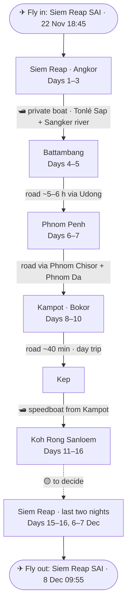

# Cambodia 2026 — the settled itinerary (7 people)

**Status:** land programme **agreed with Siem Reaper Travel** on 27 Aug 2026 — invoice `#221126CTLD`, booking `STR-43957`, **US$690 per person**. Not yet paid; see `README.md` for the one condition still outstanding before the deposit goes out.

**Dates:** depart Sat **21 Nov 2026** → home Tue **8 Dec 2026**. **16 nights on the ground** (22 Nov – 7 Dec).
**Who:** 7 adults, one extended family, backpacks only.
**Style:** explorer-historian — history + nature + unusual transport + viewpoints; independent, hidden gems, street food, off-peak.
**Route:** Siem Reap / Angkor → *Tonlé Sap boat* → Battambang → Udong → Phnom Penh → Phnom Chisor & Phnom Da → Kampot / Bokor / Kep → *speedboat* → Koh Rong Sanloem → back to Siem Reap → home.

**How the trip splits in two:**

| | Days 1–11 · 22 Nov – 2 Dec | Days 11–17 · 2 Dec – 8 Dec |
|---|---|---|
| Who runs it | **Siem Reaper Travel**, guided, private van | **Us** — nothing booked with an agency |
| Fixed? | ✅ Itinerary closed, price final | ✅ Island 2–6 Dec booked · 🟡 the way back and the nights of 6–7 Dec still open |

---

## Route map

---

## What the agency provides, leg by leg

| # | Leg | Means | Time | In the $690? |
|---|-----|-------|------|---------------|
| 0 | SAI airport → Siem Reap town | Private 15-seat van, guide meets the flight | ~50 min | ✅ |
| 1 | **Siem Reap → Battambang** | 🛥 **Private boat charter** — Tonlé Sap + Sangker river | dep 06:00, arr 14:30–15:00 | ✅ |
| 2 | Battambang → Udong → Phnom Penh | Private van | ~5–6 h driving | ✅ |
| 3 | Phnom Penh → Phnom Chisor → Phnom Da → Kampot | Private van (Phnom Da **by road**, not boat) | full day | ✅ |
| 4 | Kampot ↔ Kep | Private van, day trip | ~40 min each way | ✅ |
| 5 | **Kampot → Koh Rong Sanloem** | 🛥 **Speedboat** | 2 Dec, half day | ✅ — this is where the agency's service ends |
| 6 | Koh Rong Sanloem → Siem Reap | 🟡 **not booked** — see "the open half" below | — | ❌ |

**One guide for the whole ten days**, plus a separate licensed local guide in Phnom Penh (Cambodian guide licences are region-scoped, so this is required, not padding). The van is a **15-seat air-conditioned minibus** for seven of us plus the guide, the driver and ten days of luggage.

> **The boat is not at risk.** Sreyleak, unprompted: *"For November and December, the water level is normally sufficient… we do not anticipate needing to replace the boat."* If it is nevertheless swapped for a road transfer, the agency refunds **US$50 for the group** ($7 pp) — written into the quotation, and frankly token. See `README.md`.

---

## The signature leg — the Tonlé Sap boat (Day 4, Wed 25 Nov)

Cambodia's answer to a sleeper train, and the reason this route exists in this order. The boat leaves Siem Reap at **06:00**, crosses the open **Tonlé Sap** — Southeast Asia's largest freshwater lake — then winds for hours up the narrow, jungle-lined **Sangker river** into Battambang, arriving **14:30–15:00**. Floating villages, stilt houses, fish farms and flooded forest at eye level the whole way.

It only runs at high water (roughly Aug–Jan); late November is comfortably inside that window. Ours is a **private charter**, not the public boat — no fixed departure to miss, and space to move around. Bring sun cover, water and a hat: eight hours on open water.

---

## Day-by-day

### Angkor — Days 1–3

**Day 1 · Sun 22 Nov — arrive Siem Reap**
Land at **SAI 18:45**. The new airport is ~45–50 km out, so we reach town around 20:00. Guide meets the flight, transfer, check-in, **welcome dinner** (included). Nothing else — an Angkor pass bought after 17:00 is dated for the following day anyway, so there is no sightseeing to be had on this evening.
*🍜 Food*

**Day 2 · Mon 23 Nov — Angkor: the central temples**
**Angkor Wat at sunrise**, then **breakfast at a local family's home** (included — you cannot eat inside the temples, and this is nicer than the stalls). **Angkor Thom** and the Bayon's 200-odd stone faces, the Baphuon, the Terrace of the Elephants. **Preah Khan**, the best of the grand circuit. **Ta Prohm**, the strangler-fig temple.
*🏛 History · ⛰ Viewpoint · 🍜 Food*

**Day 3 · Tue 24 Nov — Kbal Spean, Banteay Srei, Beng Mealea, Pre Rup**
The biggest day of the trip, and an early start is not optional. **Kbal Spean** — the "river of a thousand lingas", carved into the riverbed in the 11th century: 1.5 km uphill through jungle each way, 30–45 min walking, then time at the site itself. **Banteay Srei**, the pink-sandstone miniature with the finest carving in Cambodia. **Beng Mealea**, the great collapsed temple left to the forest. **Pre Rup at sunset**.
*🏛 History · 🌿 Nature · ⛰ Viewpoint*

> **Kbal Spean was added at our request, at no extra cost** — but Sreyleak was explicit that this makes the day very full. Everyone should know that Day 3 starts early and involves a 3 km round-trip hike.

### Battambang — Days 4–5

**Day 4 · Wed 25 Nov — the boat, then colonial Battambang**
06:00 departure by **private boat** across the Tonlé Sap and up the Sangker (see above). Arrive 14:30–15:00. Evening: the **French-colonial shophouse streets** — the best-preserved colonial streetscape in Cambodia — on foot, in the good light.
*🚲 Unusual transport · 🌿 Nature · 🏛 History*

**Day 5 · Thu 26 Nov — bamboo train, Wat Banan, Phnom Sampeau**
The **bamboo train (norry)** — a bamboo platform on wheels running on abandoned track. **Wat Ek Phnom** (kept short, deliberately) and **Wat Banan**, the five-tower hilltop temple often called the model for Angkor Wat. Then **Phnom Sampeau** for the end of the day: the hilltop temple, the killing caves, and the **bat exodus** at dusk — millions of bats pouring out of the cliff for a solid half hour.
*🚲 Unusual transport · 🏛 History · ⛰ Viewpoint · 🌿 Nature*

### Phnom Penh — Days 6–7

**Day 6 · Fri 27 Nov — Battambang → Udong → Phnom Penh**
A long driving day, 5–6 h on the road. **Udong**, capital of Cambodia for 250 years until 1866 — royal stupas along a hilltop ridge, and a proper viewpoint. Then Phnom Penh and the **National Museum** (closes 17:00, so the timing is tight and Udong is the reason).
*🏛 History · ⛰ Viewpoint*

> **The trade:** Udong was added at our request, and **Kompong Luong — the floating village — came out** to pay for it. Sreyleak's argument: Battambang→Phnom Penh is 5–6 h before you add anything, and the National Museum shuts at 17:00. We accepted. We still see the lake from the boat on Day 4.

**Day 7 · Sat 28 Nov — Phnom Penh**
The **Royal Palace and Silver Pagoda** in the morning. Then **Tuol Sleng (S-21)** and **Choeung Ek** — the hard part of the trip, and the reason nothing else is scheduled around them. The agency has committed to leaving proper space between the two.
*🏛 History*

### The coast — Days 8–10

**Day 8 · Sun 29 Nov — Phnom Penh → Kampot, by way of two hills**
**Phnom Chisor**, an 11th-century Angkorian temple on a ridge with a long stair and a view over the plain. **Phnom Da** — 6th–7th century, Funan period, **the only genuinely pre-Angkorian site on the whole trip**, reached by road near Angkor Borei. On to Kampot for three nights.
*🏛 History · ⛰ Viewpoint*

> **Tonle Bati was dropped at our request** — Ta Prohm Bati is late-12th-century Bayon style, i.e. a smaller repeat of what we will have seen at Angkor, and 29 Nov is a Sunday, when it fills with Phnom Penh day-trippers. **Open:** whether the **Takeo–Angkor Borei canal boat** is running; the agency will check nearer the date and add it if it fits.

**Day 9 · Mon 30 Nov — Bokor, Phnom Chhnork, the river at sunset**
**Bokor Hill Station** — the abandoned French hill station in the cloud forest, the trip's headline ruin. **Phnom Chhnork**, a 7th-century pre-Angkorian brick shrine inside a limestone cave, reached across the rice fields. **Sunset cruise on the Kampot river** (included).
*🏛 History · 🌿 Nature · ⛰ Viewpoint · 🚲 Unusual transport*

**Day 10 · Tue 1 Dec — La Plantation and Kep**
**La Plantation** — Kampot pepper, the real thing, and how it is grown. Then Kep: the **crab market**, the **abandoned 1960s modernist villas** left from the Sihanouk-era resort town, and **Kep National Park**. Back to Kampot for the last night on the mainland.
*🍜 Food · 🏛 History · 🌿 Nature*

### The island and the way home — Days 11–17

**Day 11 · Wed 2 Dec — Kampot → Koh Rong Sanloem by speedboat**
The last thing the agency does for us. Speedboat from Kampot to the island, and from the moment we step off it we are on our own.
*🚲 Unusual transport*

**Days 12–14 · Thu 3 – Sat 5 Dec — Koh Rong Sanloem** ✅ **booked and paid**
Snorkelling the marine park, the jungle walk to the old French lighthouse, bioluminescent plankton on a dark night, and the west-coast beaches over the ridge. **No ATMs on the island — carry USD in small notes.**
Four nights, **2–6 Dec, check-out on the morning of Sunday 6 December**. Accommodation is arranged and paid — nothing for anyone to book. 🎁 *Where we are staying is deliberately not written down; it is a birthday present for two of us.*

**Day 15 · Sun 6 Dec — off the island** 🟡 **not booked**
Check-out is this morning, so this is a travel day whether we like it or not. Ferry to Sihanoukville, then north. **Tonight is the first of two nights with nowhere booked.**

**Day 16 · Mon 7 Dec — Siem Reap** 🟡 **not booked**
We need to be in Siem Reap tonight, near enough to the airport for a 09:55 departure.

**Day 17 · Tue 8 Dec — fly home**
SAI 09:55 → home 22:40.

---

## The open half — what still has to be decided

Everything from **2 December** onward was deliberately kept out of the agency brief. Three decisions are outstanding:

| # | Decision | Why it is open | What it costs / affects |
|---|---|---|---|
| 1 | **Hotels — 10 nights, Days 1–11** | Excluded from the $690 on purpose, so we choose freely. Sreyleak may be able to pass on her contracted rates **only if she books them** — she still has to clear that with her team, and high-season availability is not guaranteed. | 3 rooms (2 twins + 1 triple) for 7. At $45 / $60 / $80 per room per night ≈ **$193 / $257 / $343 pp** |
| 2 | **Dinners** | Only the Day 1 welcome dinner is included. Lunches are covered on Days 2–10. | The agency's own guidance is **~$20 pp per day** of walking-around money |
| 3 | **Getting off the island, and the two nights of 6 and 7 Dec** | The island booking ends with check-out on **6 Dec**, so we are off it that morning whether or not we have decided how to get home. Ferry to Sihanoukville, then **Air Cambodia KOS → SAI** (~1 h 10, seasonal — verify the date), **via Phnom Penh**, or overland (a full day). | Two nights, 3 rooms, plus roughly **$82–155 pp** for the ferry, the flight and the transfers |

---

## Group logistics

- **Visa on arrival: $30 per person, cash in US dollars, plus two passport photographs.** Passports must be valid for six months beyond departure from Cambodia. (An e-visa via [evisa.gov.kh](https://www.evisa.gov.kh/) is the alternative — official site only, there are many lookalikes.)
- **Insurance with medical-evacuation cover** — the agency's liability clause is broad and regionally standard; insurance is the answer to it, and Sreyleak recommends it herself.
- **Money:** USD everywhere, riel for small change. No ATMs on Koh Rong Sanloem.
- **Spending money:** the agency suggests ~$20 pp per day on top of the package.
- **Weather:** late November is the opening of the dry season — warm days ~24–31 °C, cooler mornings, low rain.
- **Pace:** Day 3 (Kbal Spean) and Day 6 (Battambang → Phnom Penh) are the two long ones. Day 4 is eight hours on a boat, which is the point rather than the problem.

---

**See also:** [`README.md`](README.md) — the decision record, the money, the terms and the one thing still to settle before we pay · [`Cambodia-budget.xlsx`](Cambodia-budget.xlsx) · [`daily-guide/index.html`](daily-guide/index.html) · [`route-map/index.html`](route-map/index.html)
